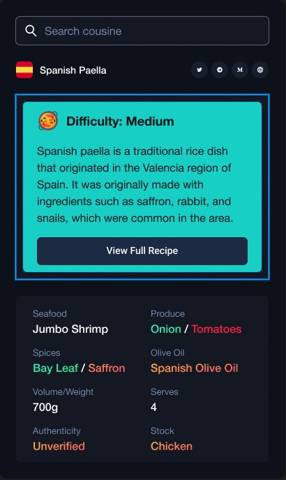

My First Chrome Extension using React, TypeScript and Vanilla CSS.

# App Description

This app is a tool that can be added to the Google Chrome web browser. Its main purpose is to provide information about different dishes and the art of cooking. It may include features like a list of recipes, pictures of dishes, or information about cooking techniques. The app is designed to help users explore and learn more about the world of gastronomy.

## Available Scripts

In the project directory, you can run:

### `npm run build:extension`
bundle the extension.

## How to use

Go to extension developer mode and upload dist folder.

## Code

I used manifest v3:
```
{
  "version": "1.0.0",
  "manifest_version": 3,
  "name": "Extension",
  "permissions": ["tabs"],
  "action": {
    "default_popup": "js/index.html",
    "default_title": "React Chrome Extension"
  },
  "content_security_policy_extention": "style-src 'self' https://unpkg.com"
}
```
